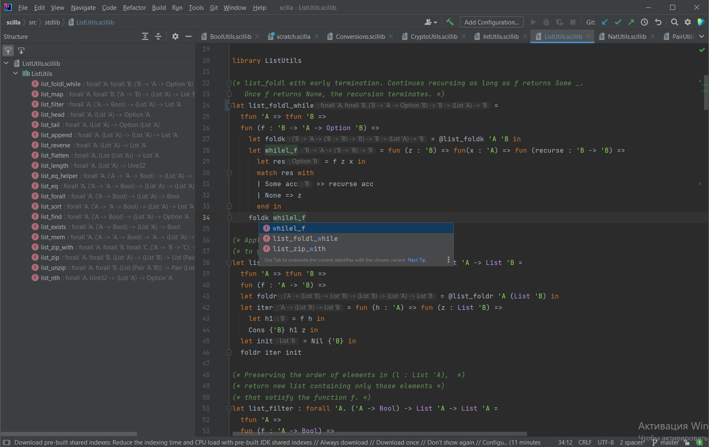

# Scilla Language Plugin

[**github.com/zloyrobot/intellij-scilla**](https://github.com/zloyrobot/intellij-scilla)

Scilla language plugin for IntelliJ IDEA and other IntelliJ Platform based IDEs.


[](https://www.gnu.org/licenses/gpl-3.0)



## About

[Scilla](https://scilla.readthedocs.io) (Smart Contract Intermediate-Level Language) is a
functional smart contract language used on the Zilliqa blockchain. This plugin brings rich
editing support for Scilla source files to the IntelliJ Platform.

The plugin recognizes files with the `.scilla` (contracts) and `.scillib` (libraries)
extensions and provides a custom lexer, parser, and type analysis for the language.

## Features

- **Syntax highlighting** with a dedicated color settings page
- **Code folding** for blocks and definitions
- **Structure view** for quick navigation through contracts, libraries, and their members
- **Navigation**: Go to Class / Go to Symbol contributors and find usages
- **Type support**: type info on hover, inline type hints, and parameter info
- **Formatting** and code style settings
- **Refactoring**: rename support for symbols and type variables, plus a names validator
- **Brace matching** and identifier highlighting
- **Inspection**: highlighting of unresolved symbols

## Building the plugin and launching it in a sandbox

1. Install SDK and prepare backend plugin build using Gradle
    * if using IntelliJ IDEA:

      Open the `intellij-scilla` project in IntelliJ IDEA. `intellij-scilla` uses the [gradle-intellij-plugin](https://github.com/JetBrains/gradle-intellij-plugin) Gradle plugin that downloads the IntelliJ Platform SDK, packs the plugin and installs it into a sandboxed IDE.

      Open the *Gradle* tool window in IntelliJ IDEA (*View | Tool Windows | Gradle*), and execute the `scilla/Tasks/intellij/buildPlugin` task.

    * if using Gradle command line:

        ```
        $ cd ./intellij-scilla
        $ ./gradlew buildPlugin
        ```

2. Launch IDEA with the plugin installed

    * if using IntelliJ IDEA:

      Open the *Gradle* tool window in IntelliJ IDEA (*View | Tool Windows | Gradle*), and execute the `scilla/Tasks/intellij/runIde` task. This will install the plugin to a sandbox, and launch IDEA with the plugin.

    * if using Gradle command line:

        ```
        $ ./gradlew runIde
        ```

## Installing to an existing IDEA instance

1. Execute the `buildPlugin` Gradle task.


        $ cd ./intellij-scilla
        $ ./gradlew buildPlugin

2. Install the plugin (`intellij-scilla/build/distributions/Scilla.zip`) to your IDEA installation [from disk](https://www.jetbrains.com/help/idea/managing-plugins.html#install_plugin_from_disk).

## Requirements

- IntelliJ IDEA (or another IntelliJ Platform IDE), build `212`–`222`
- JDK 8 or later

## Project structure

- `src/main/kotlin/com/zloyrobot/scilla/lang` — language core: lexer, parser, PSI elements, types, and indexes
- `src/main/kotlin/com/zloyrobot/scilla/ide` — IDE integrations: highlighting, formatting, navigation, refactoring, and inspections
- `src/main/resources/META-INF/plugin.xml` — plugin descriptor and extension registrations

## License

This project is licensed under the [GNU General Public License v3](https://www.gnu.org/licenses/gpl-3.0).
